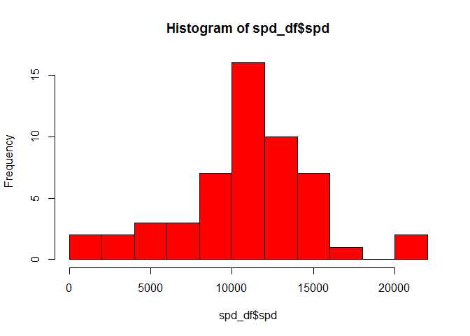
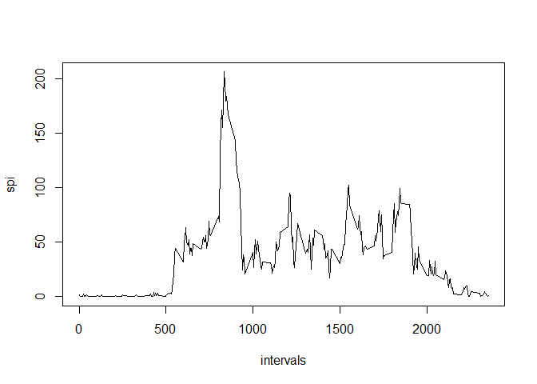
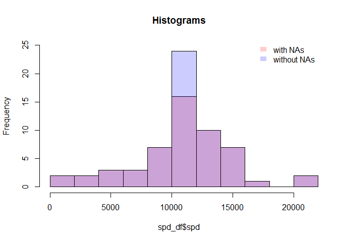
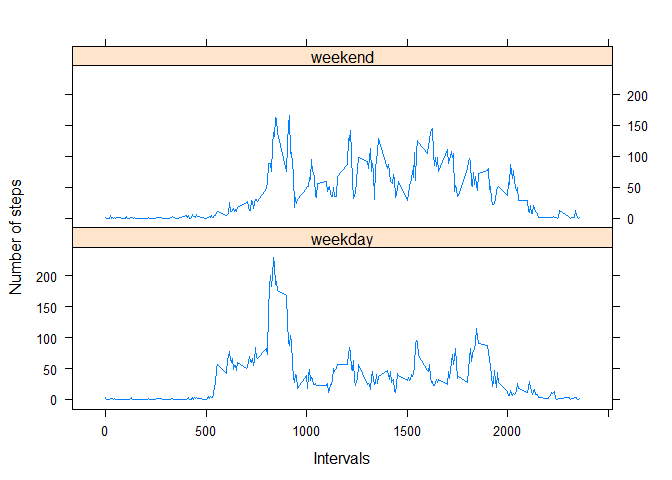

# Reproducible Research: Peer Assessment 1


## Loading and preprocessing the data

```r
  DF <- read.csv("activity.csv",header=T)
  head(DF)
```

```
##   steps       date interval
## 1    NA 2012-10-01        0
## 2    NA 2012-10-01        5
## 3    NA 2012-10-01       10
## 4    NA 2012-10-01       15
## 5    NA 2012-10-01       20
## 6    NA 2012-10-01       25
```

## What is mean total number of steps taken per day?

### 1. Total number of steps per day

First, the total number of steps per day is computed using tapply and the result is saved in a data.frame object. Hereby the missing values are ignored, which means that they are removed from the calculation.


```r
spd <- tapply(DF$steps,DF$date,sum)
spd_df <- data.frame(spd = spd)
head(spd_df)
```

```
##              spd
## 2012-10-01    NA
## 2012-10-02   126
## 2012-10-03 11352
## 2012-10-04 12116
## 2012-10-05 13294
## 2012-10-06 15420
```

### 2. Histogram of the total number of steps per day

The histogram of the total number of steps per day is computed by


```r
hist(spd_df$spd,col="red",breaks=10)
```

 

### 3. The mean and median of the total number of steps per day


```r
mean(spd_df$spd,na.rm = TRUE)
```

```
## [1] 10766.19
```

```r
median(spd_df$spd,na.rm = TRUE)
```

```
## [1] 10765
```

## What is the average daily activity pattern?

### 1. Average number of steps per day

The mean across all days of the number of steps in each 5-minute interval (removing the missing values) can be computed by 


```r
spi <- tapply(DF$steps,DF$interval,mean,na.rm=T)
```

The corresponding plot is


```r
intervals <- DF$interval[1:nrow(spi)]
plot(intervals,spi,type="l")
```

 

### 2. Interval with the maximum number of steps

The 5-minute interval containing the maximum number of steps can be computed by


```r
intervals[spi == max(spi)]
```

```
## [1] 835
```

## Imputing missing values

### 1 Total number of NAs in the dataset

The total number of missing values in the dataset can be computed by


```r
total_na <- sum(as.numeric(is.na(DF$steps)))
print(total_na)
```

```
## [1] 2304
```

### 2 Filling the missing values in the data set

The NAs in the dataset are replaced by the mean of that 5-minute interval across all days. 

### 3 Creating the new data set with the replaced NAs

The new dataset is called DF1. It can be created by


```r
DF1 <- DF
ind <- vector("numeric",length = total_na)

for (i in 1:total_na){
    ind[i] <- which(intervals == DF$interval[is.na(DF$steps)][i])
    DF1$steps[is.na(DF$steps)][i] <- spi[[ind[i]]]
}
head(DF)
```

```
##   steps       date interval
## 1    NA 2012-10-01        0
## 2    NA 2012-10-01        5
## 3    NA 2012-10-01       10
## 4    NA 2012-10-01       15
## 5    NA 2012-10-01       20
## 6    NA 2012-10-01       25
```

```r
head(DF1)
```

```
##       steps       date interval
## 1 1.7169811 2012-10-01        0
## 2 0.3396226 2012-10-01        5
## 3 0.1320755 2012-10-01       10
## 4 0.1509434 2012-10-01       15
## 5 0.0754717 2012-10-01       20
## 6 2.0943396 2012-10-01       25
```

In the following it is shown that the number of missing values in the new dataset is zero.


```r
sum(as.numeric(is.na(DF1$steps)))
```

```
## [1] 0
```

### 4 The histograms of the total number of steps per day are computed by


```r
spd1 <- tapply(DF1$steps,DF1$date,sum)
spd1_df <- data.frame(spd = spd1)

h <- hist(spd_df$spd,breaks=10,plot=F)
h_new <- hist(spd1_df$spd,breaks=10,plot=F)

color <- rgb(1,0,0,.2)
color_new <- rgb(0,0,1,.2)
xlim <- range(0,max(spd1_df$spd,spd_df$spd,na.rm=T))
ylim <- range(0,25)
plot(h, col = color, main="Histograms",xlim = xlim, ylim = ylim)
plot(h_new, col= color_new,add = T,ylim = )
legend('topright',c('with NAs','without NAs'),
       fill = c(color,color_new), bty = 'n',
       border = NA)
```

 

It can be seen that the histograms overlap in almost all bars. By filling the missing values with the mean of the corresponding 5-minute interval across all days, the frequency in the middle bar will be higher (which includes the mean of the total number of steps of all days). 

The increased frequency in the middle bar is due to the fact that the sum of all steps that are the "averaged 5 min intervals across all days" is equal to the average of the total number of steps per day across all days. To show this, suppose there is only one day with missing numbers and let $x_{i,j}$, with $i=1,\ldots,n$ ($n$ = number of intervals per day) and $j=1,\ldots,T-1$ ($T$ = total number of days), denote a non-missing number of steps in the 5-min interval $i$ and day $j$. Let $\mu_{i,T}$ denote the only missing number of steps in the 5-min interval $i$ and day $T$. Then

$$
\begin{equation*}
\mu_{i,T} = \frac{1}{T}\sum_{j=1}^{T-1} x_{i,j}.
\end{equation*}$$

Let $X_j$ denote the total number of steps on the day j. Thus
$$
\begin{align*}
X_T = \sum_{i=1}^n \mu_{i,T} &= \sum_{i=1}^n \frac{1}{T-1}\sum_{j=1}^{T-1} x_{i,j}\\
 &= \frac{1}{T-1} \sum_{i=1}^n \sum_{j=1}^{T-1} x_{i,j}\\
 &= \frac{1}{T-1} \sum_{j=1}^{T-1} \sum_{i=1}^n x_{i,j}\\
 &= \frac{1}{T-1} \sum_{j=1}^{T-1} X_j,
\end{align*}$$

which is the average of the total number of (non-missing) steps per day across all days (the mean of the original dataset). The missing steps beeing thus replaced by the mean of the original dataset, the middle bar of the new histogram, which includes this mean, has a higher frequency.

Replacing missing values with the mean of the known values, the mean of the new dataset will remain equal to the mean of the original dataset. The median changes. The new value of the median depends on how many points are being replaced. The more missing values are inserted, the nearer the median is to the mean. 

The means and medians are given below


```r
mean(spd_df$spd,na.rm = TRUE)
```

```
## [1] 10766.19
```

```r
median(spd_df$spd,na.rm = TRUE)
```

```
## [1] 10765
```

```r
mean(spd1_df$spd)
```

```
## [1] 10766.19
```

```r
median(spd1_df$spd)
```

```
## [1] 10766.19
```

## Are there differences in activity patterns between weekdays and weekends?

### 1. Creating a new factor variable in the dataset with two levels - "weekday" and "weekend"


```r
DF1$date <- as.Date(DF1$date)

wd_new <- rep("weekday", nrow(DF1))

nr_weekend <- sum(as.numeric( weekdays(DF1$date,abbreviate = T) == "Sa" | 
                                weekdays(DF1$date,abbreviate = T) == "So"))

wd_new[weekdays(DF1$date,abbreviate = T) == "Sa" | 
                     weekdays(DF1$date,abbreviate = T) == "So"] <- rep("weekend", nr_weekend)
DF1$wd <- as.factor(wd_new)
```

### 2. The panel plot containing the time series of the 5-min interval (x-axis) and the average number of steps taken, averaged across all weekday days or weekend days (y-axis)


```r
DF1_wd <- DF1[DF1$wd == "weekday",]
spi_wd <- tapply(DF1_wd$steps,DF1_wd$interval,mean)
SPI_wd <- data.frame(interval = intervals,spi = spi_wd,wd = rep("weekday", length(spi_wd)))

DF1_we <- DF1[DF1$wd == "weekend",]
spi_we <- tapply(DF1_we$steps,DF1_we$interval,mean)
SPI_we <- data.frame(interval = intervals,spi = spi_we,wd = rep("weekend", length(spi_we)))

SPI <- rbind(SPI_wd,SPI_we)

library(lattice)
xyplot(SPI$spi ~ SPI$interval | SPI$wd, data=SPI, type = "l",
       main="", xlab="Intervals",  ylab="Number of steps",layout=c(1,2))
```

 
